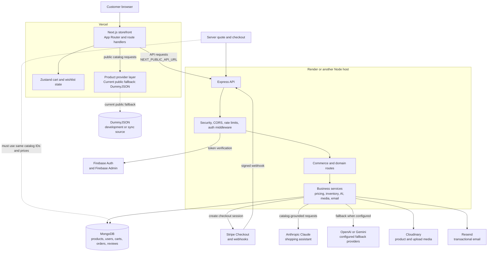

# NeoVerse Store

NeoVerse Store is an immersive commerce application focused on helping customers make better purchase decisions through product inspection, spatial visualization, and catalog-grounded assistance.

The repository currently contains a Next.js storefront and a separate Express API. The web application is deployed on Vercel. The API is configured for deployment on Render and uses MongoDB for server-side commerce data.

> The project is an active build. The storefront is live, but the catalog and checkout systems still need to be unified before unrestricted production commerce is enabled.

## Repository structure

```text
AR-VR-Assignment/
├── README.md
└── neoverse-store/
    ├── src/                  # Next.js storefront
    ├── backend/              # Express and MongoDB API
    ├── public/               # Static assets
    ├── docs/                 # Product and architecture documentation
    ├── DESIGN.md             # Visual and interaction design rules
    ├── ARCHITECTURE.md       # System architecture
    ├── package.json          # Web app scripts and dependencies
    └── vercel.json           # Vercel configuration
```

## Applications

### Web application

The web application is located in [`neoverse-store/`](./neoverse-store/).

It provides:

- Product browsing, search, filtering, sorting, and category pages.
- Product detail and inspection surfaces.
- Persistent cart and wishlist state.
- Checkout and server quote integration.
- Account and dashboard pages.
- 3D, AR, and VR-related experiences where supported by the device and product data.
- Catalog-grounded shopping assistance through the API.

Production URL:

- [https://neoverse-store.vercel.app](https://neoverse-store.vercel.app)

### API

The Express API is located in [`neoverse-store/backend/`](./neoverse-store/backend/).

It provides the server boundary for:

- MongoDB-backed products and categories.
- Server-side pricing, discounts, shipping, tax, and stock checks.
- Orders and checkout quotes.
- Stripe Checkout and webhook handling.
- Firebase Admin authentication.
- Cart, wishlist, reviews, recommendations, uploads, contact, and email operations.
- Claude-based shopping assistance with existing provider fallbacks.

The API has a public liveness route:

```text
GET /api/health
```

The deployed API URL is environment-specific and is intentionally not hard-coded here. Configure it in the web app as `NEXT_PUBLIC_API_URL`.

## Current production boundary

The public web catalog currently uses the DummyJSON provider through the Next.js application. The Express commerce API uses MongoDB product records.

These sources currently expose different product identifiers. For example, the web catalog can return IDs such as `dummyjson-1`, while the order system expects MongoDB product records. This must be resolved before production checkout is treated as fully reliable.

The intended direction is:

1. MongoDB becomes the production catalog source of truth.
2. Product prices, inventory, capabilities, and identifiers are shared by browsing, quote, order, and Stripe flows.
3. DummyJSON remains an explicit development or synchronization source rather than an independent checkout catalog.

## Architecture flow

The system is deployed as two applications. The browser loads the Next.js storefront from Vercel, then calls the Express API for account, commerce, payment, and AI operations. External services remain behind the API wherever credentials or server-side validation are required.



### Request boundaries

- **Browser to Next.js:** page rendering, public catalog routes, cart and wishlist UI state, and immersive experiences.
- **Browser to Express:** authenticated account requests, cart synchronization, server quotes, orders, checkout sessions, and AI requests.
- **Express to MongoDB:** authoritative pricing, stock, order, account, and review data.
- **Express to Stripe:** payment-session creation and signed webhook processing. Stripe events must not be trusted without signature verification.
- **Express to AI providers:** catalog context and bounded conversation history. Provider credentials never belong in browser-exposed environment variables.
- **Catalog synchronization:** DummyJSON may supply development data, but it must not remain a second independent source of truth for production checkout.

## Quick start

### Requirements

- Node.js 20.9 or newer.
- npm.
- MongoDB for the API.
- Firebase credentials for authenticated flows.
- Stripe credentials for payment testing.
- Provider credentials for any optional integrations you enable.

### Install dependencies

```bash
cd neoverse-store
npm install

cd backend
npm install
```

### Configure the web app

Create `neoverse-store/.env.local`:

```env
NEXT_PUBLIC_API_URL=http://localhost:5000/api

NEXT_PUBLIC_FIREBASE_API_KEY=
NEXT_PUBLIC_FIREBASE_AUTH_DOMAIN=
NEXT_PUBLIC_FIREBASE_PROJECT_ID=
NEXT_PUBLIC_FIREBASE_STORAGE_BUCKET=
NEXT_PUBLIC_FIREBASE_MESSAGING_SENDER_ID=
NEXT_PUBLIC_FIREBASE_APP_ID=
NEXT_PUBLIC_FIREBASE_MEASUREMENT_ID=
```

### Configure the API

Create `neoverse-store/backend/.env`:

```env
NODE_ENV=development
PORT=5000
FRONTEND_URL=http://localhost:3000
MONGODB_URI=mongodb://127.0.0.1:27017/neoverse

FIREBASE_SERVICE_ACCOUNT_KEY=

STRIPE_SECRET_KEY=
STRIPE_WEBHOOK_SECRET=

ANTHROPIC_API_KEY=
ANTHROPIC_AUTH_TOKEN=
ANTHROPIC_MODEL=claude-opus-5
OPENAI_API_KEY=
GEMINI_API_KEY=

CLOUDINARY_CLOUD_NAME=
CLOUDINARY_API_KEY=
CLOUDINARY_API_SECRET=
RESEND_API_KEY=
RESEND_FROM_EMAIL=
```

Keep all secrets server-side. Do not commit `.env` files, Firebase service-account credentials, payment keys, webhook secrets, or AI provider keys.

### Run locally

Start the API in one terminal:

```bash
cd neoverse-store/backend
npm run dev
```

Start the web app in another:

```bash
cd neoverse-store
npm run dev
```

Open:

- Web app: [http://localhost:3000](http://localhost:3000)
- API health: [http://localhost:5000/api/health](http://localhost:5000/api/health)

If MongoDB is empty, the API can synchronize products and categories from its external product service. The seed utility can also be run explicitly:

```bash
cd neoverse-store/backend
node seeder.js
```

Review the synchronization behavior before using it against a production database.

## Useful commands

Run from `neoverse-store/`:

```bash
npm run dev
npm run build
npm run start
npm run lint
npx tsc --noEmit
```

Run from `neoverse-store/backend/`:

```bash
npm run dev
npm start
```

## Deployment

### Vercel

The web app is configured through [`neoverse-store/vercel.json`](./neoverse-store/vercel.json).

```bash
cd neoverse-store
npm run build
npx vercel deploy --prod --yes
```

Set `NEXT_PUBLIC_API_URL` in the Vercel production environment to the deployed API base URL, including `/api`.

Verify after deployment:

```bash
curl -I https://neoverse-store.vercel.app
curl https://neoverse-store.vercel.app/api/categories
curl "https://neoverse-store.vercel.app/api/products?limit=1"
```

### Render

The API deployment is described in [`neoverse-store/backend/render.yaml`](./neoverse-store/backend/render.yaml).

The service uses:

- Root directory: `backend`
- Build command: `npm install`
- Start command: `npm start`

After configuring the required environment variables, verify the service before connecting it to Vercel:

```bash
curl https://<api-host>/api/health
```

## Documentation map

Start with these documents before making significant changes:

- [`neoverse-store/README.md`](./neoverse-store/README.md) — detailed application setup, API reference, deployment, and operational notes.
- [`neoverse-store/DESIGN.md`](./neoverse-store/DESIGN.md) — visual language, interaction rules, accessibility, and design review criteria.
- [`neoverse-store/ARCHITECTURE.md`](./neoverse-store/ARCHITECTURE.md) — architecture and system boundaries.
- [`neoverse-store/docs/PRD.md`](./neoverse-store/docs/PRD.md) — product requirements and intended customer value.
- [`neoverse-store/docs/ARCHITECTURE_REVIEW.md`](./neoverse-store/docs/ARCHITECTURE_REVIEW.md) — known architectural risks and recommendations.
- [`neoverse-store/docs/FRONTEND_CONTEXT_GOVERNANCE.md`](./neoverse-store/docs/FRONTEND_CONTEXT_GOVERNANCE.md) — frontend change and context governance.
- [`neoverse-store/docs/FRONTEND_DESIGN_PLAN.md`](./neoverse-store/docs/FRONTEND_DESIGN_PLAN.md) — frontend implementation plan.

## Engineering priorities

The highest-value production work is:

1. Unify the web and API catalog sources and product IDs.
2. Verify the Render API deployment and configure its URL in Vercel.
3. Add idempotency and integration tests around order creation and Stripe webhooks.
4. Enforce a fail-closed production CORS policy.
5. Remove and rotate any credential files that have entered the repository.
6. Add automated coverage for pricing, inventory reservation, authentication, and checkout failure paths.

## License

No license file is currently included. Add an explicit license before distributing the repository outside its owning organization.
