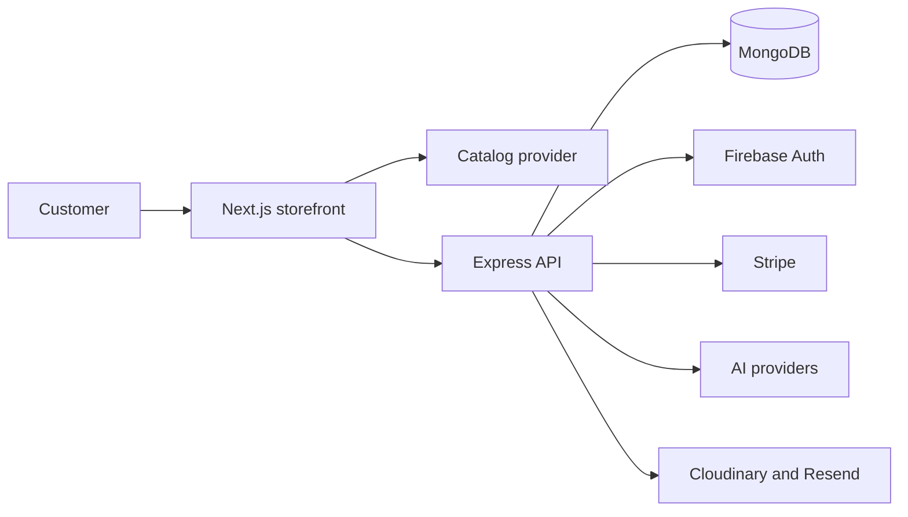

# NeoVerse Store

> Inspect the object. Understand the fit. Decide with confidence.

NeoVerse is an inspection-first commerce experience for products that are hard to judge from a flat image alone.

It brings useful evidence into the buying journey: product details, specifications, availability, comparison, server-validated pricing, and supported 3D or spatial inspection.

<p align="center">
  <a href="https://neoverse.sujit.top/"><strong>Try the live product</strong></a>
  ·
  <a href="https://neoverse.sujit.top/docs"><strong>Read the documentation</strong></a>
</p>

---

## Contents

- [Overview](#overview)
- [The problem](#the-problem)
- [What is included](#what-is-included)
- [Who it is for](#who-it-is-for)
- [Current status](#current-status)
- [Architecture](#architecture)
- [Technology](#technology)
- [Run locally](#run-locally)
- [Documentation](#documentation)
- [Roadmap](#roadmap)
- [Repository](#repository)
- [License](#license)

## Overview

Most product pages answer “does this look good?” NeoVerse is designed to help answer the questions that come next:

- Will it fit my space, desk, room, or body?
- What are the dimensions, materials, and useful specifications?
- Is it available now?
- What will I actually pay?
- Which alternative is the better choice?

The product goal is simple:

> **Reduce uncertainty before checkout.**

## The problem

Customers often need more context before buying a physical product online. When that context is missing, they hesitate, abandon carts, or make a purchase they later regret.

NeoVerse treats inspection as part of commerce—not as a separate technology demo. Browsing, product details, comparison, assistance, pricing, inventory, and checkout are designed as one decision path.

## What is included

- Product browsing, search, filtering, sorting, and category discovery
- Product detail pages with structured evidence
- Persistent cart and wishlist state
- Account and dashboard surfaces
- Catalog-grounded shopping assistance
- 3D, AR, and VR-related interfaces where product and device data support them
- Server-side quote, inventory, checkout, and payment flows
- Fumadocs documentation at [`/docs`](https://neoverse.sujit.top/docs)

## Who it is for

NeoVerse is intended for:

- Shoppers researching higher-consideration products
- People who need to understand scale, fit, compatibility, or specifications
- Merchants improving product information and qualified purchase decisions
- Product and engineering teams exploring inspection-led commerce

The current catalog contains a broad development product set. The product architecture is designed to support categories where visual context and evidence matter.

## Current status

The storefront is live at [neoverse.sujit.top](https://neoverse.sujit.top/).

This is an active product build, not a finished production commerce platform. The current public catalog uses DummyJSON through the storefront provider layer, while the Express commerce API uses MongoDB records. Their product identifiers are not yet fully unified.

Until that is resolved, unrestricted production checkout should not be treated as complete.

The next production milestone is to make MongoDB the shared source of truth for:

- Product identity
- Price and discounts
- Inventory
- Product capabilities
- Quotes
- Orders
- Stripe checkout records

This limitation is kept visible because reliable commerce depends on clear data ownership.

## Architecture

The system has two applications:

1. A Next.js storefront deployed to Vercel.
2. An Express API backed by MongoDB and external services.



The important boundary is the API. The browser can request a quote, but it does not decide the final price, tax, shipping, stock, order state, or payment result.

For the full system model, see [Product architecture](https://neoverse.sujit.top/docs/product-architecture) or [`neoverse-store/ARCHITECTURE.md`](./neoverse-store/ARCHITECTURE.md).

## Technology

| Area | Technology |
| --- | --- |
| Storefront | Next.js 16, React 19, TypeScript |
| Styling | Tailwind CSS v4, Space Grotesk, Inter |
| State | Zustand and TanStack Query |
| 3D and spatial UI | Three.js, React Three Fiber, Drei, model-viewer, WebXR |
| API | Node.js, Express, Mongoose |
| Database | MongoDB |
| Authentication | Firebase Authentication and Firebase Admin |
| Payments | Stripe Checkout and webhooks |
| AI assistance | Anthropic SDK with configured provider fallbacks |
| Media and email | Cloudinary and Resend |
| Documentation | Fumadocs MDX |
| Hosting | Vercel and Render |

## Run locally

### Requirements

- Node.js 20.9 or newer
- npm
- MongoDB for API development
- Firebase credentials for authenticated flows
- Stripe credentials for payment testing
- Optional provider credentials for AI, media, and email integrations

### Install

```bash
cd neoverse-store
npm install --legacy-peer-deps

cd backend
npm install
```

Configure environment variables using the examples in the [Getting started guide](https://neoverse.sujit.top/docs/getting-started). Keep secrets out of Git.

### Start the API

```bash
cd neoverse-store/backend
npm run dev
```

### Start the storefront

In another terminal:

```bash
cd neoverse-store
npm run dev
```

Open:

- Storefront: [http://localhost:3000](http://localhost:3000)
- Documentation: [http://localhost:3000/docs](http://localhost:3000/docs)
- API health: [http://localhost:5000/api/health](http://localhost:5000/api/health)

### Validate changes

```bash
cd neoverse-store
npm run lint
npx tsc --noEmit
npm run build
npm run react-doctor:design
```

## Documentation

The Fumadocs site is the primary documentation experience:

- [Documentation home](https://neoverse.sujit.top/docs)
- [Getting started](https://neoverse.sujit.top/docs/getting-started)
- [Product architecture](https://neoverse.sujit.top/docs/product-architecture)
- [Frontend design](https://neoverse.sujit.top/docs/frontend-design)
- [Commerce API](https://neoverse.sujit.top/docs/commerce-api)
- [Immersive inspection](https://neoverse.sujit.top/docs/immersive-inspection)
- [Security](https://neoverse.sujit.top/docs/security)
- [Deployment](https://neoverse.sujit.top/docs/deployment)
- [Contributing](https://neoverse.sujit.top/docs/contributing)

Repository documents:

- [`neoverse-store/README.md`](./neoverse-store/README.md) — detailed technical setup and operations
- [`neoverse-store/docs/PRD.md`](./neoverse-store/docs/PRD.md) — product requirements
- [`neoverse-store/docs/FRONTEND_DESIGN_SYSTEM.md`](./neoverse-store/docs/FRONTEND_DESIGN_SYSTEM.md) — frontend implementation contract
- [`neoverse-store/docs/SECURITY_HARNESS.md`](./neoverse-store/docs/SECURITY_HARNESS.md) — security scanning workflow
- [`neoverse-store/DESIGN.md`](./neoverse-store/DESIGN.md) — visual language and interaction rules

## Roadmap

- Unify catalog identifiers across storefront, API, quotes, orders, inventory, and Stripe
- Make MongoDB the production catalog source of truth
- Add integration coverage for pricing, inventory reservation, checkout, and webhooks
- Expand reliable product models and spatial assets
- Add operational monitoring for catalog, AI, order, and payment failures
- Measure whether inspection improves decision confidence and reduces avoidable returns

## Repository

```text
AR-VR-Assignment/
├── README.md
└── neoverse-store/
    ├── src/                  # Next.js storefront and docs route
    ├── content/docs/         # Fumadocs MDX content
    ├── backend/              # Express and MongoDB API
    ├── public/               # Images, models, textures, and logo assets
    ├── docs/                 # Product and engineering documents
    ├── source.config.ts      # Fumadocs content configuration
    ├── next.config.mjs       # Next.js and Fumadocs configuration
    └── vercel.json           # Vercel deployment configuration
```

## License

No license file is currently included. Add an explicit license before distributing the project outside its owning organization.
