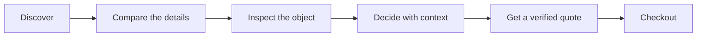
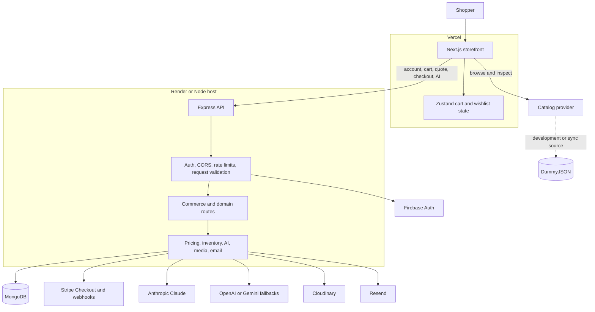

# NeoVerse Store

## Product decisions deserve better evidence

NeoVerse is an inspection-first commerce experience for products that are difficult to judge from a flat image alone.

It brings product evidence closer to the buying decision: meaningful specifications, availability, price, comparison, and supported 3D or spatial inspection.

> **More confidence before checkout.**

[](https://neoverse.sujit.top/)
[](https://neoverse.sujit.top/docs)

**Live product:** [neoverse.sujit.top](https://neoverse.sujit.top/)  ·  **Documentation:** [neoverse.sujit.top/docs](https://neoverse.sujit.top/docs)

---

## Table of contents

- [At a glance](#at-a-glance)
- [The problem](#the-problem)
- [What NeoVerse does](#what-neoverse-does)
- [Who it is for](#who-it-is-for)
- [Why this is different](#why-this-is-different)
- [Product experience](#product-experience)
- [Live product status](#live-product-status)
- [System overview](#system-overview)
- [Technology](#technology)
- [Design direction](#design-direction)
- [Launch and demo](#launch-and-demo)
- [Roadmap](#roadmap)
- [Run locally](#run-locally)
- [Documentation map](#documentation-map)
- [Repository map](#repository-map)
- [Status and license](#status-and-license)

---

## At a glance

| | |
| --- | --- |
| **Product** | Inspection-first commerce for high-consideration products |
| **Primary user** | People who research before they buy |
| **Core problem** | Product pages often leave fit, scale, specifications, and final cost uncertain |
| **Core outcome** | A clearer decision before checkout |
| **Live storefront** | [neoverse.sujit.top](https://neoverse.sujit.top/) |
| **Product documentation** | [NeoVerse Docs](https://neoverse.sujit.top/docs) |
| **Current stage** | Live product build; production catalog unification in progress |

---

## The problem

Online shopping gives people more choice, but not always enough confidence to choose well.

Before buying, customers still ask:

- Will it fit the room, desk, space, or body it is meant for?
- Does the material, shape, and scale work outside a studio image?
- Which specifications actually matter for this decision?
- Is it available now?
- What will the final price be after shipping, tax, and discounts?
- Can alternatives be compared without opening ten more tabs?

For high-consideration products, unanswered questions create hesitation, abandoned carts, avoidable returns, and lower trust.

NeoVerse is built around the moment before conversion: the moment when a customer decides whether the object is right for them.

---

## What NeoVerse does

### Browse with purpose

Search, filter, sort, and compare products while keeping useful evidence visible: price, availability, ratings, specifications, and category context.

### Inspect before committing

Product pages combine imagery, structured facts, and supported 3D or spatial tools so customers can understand more than a single product photo can show.

### Ask grounded questions

The shopping assistant helps compare products and narrow the catalog using available product context. It is designed not to invent products, prices, stock, reviews, capabilities, or delivery promises.

### Check out with server-side validation

The API recalculates pricing and validates inventory. The browser is not trusted for totals, discounts, shipping, tax, or stock availability.

---

## Who it is for

### Shoppers

NeoVerse is for people who research before they buy—especially when appearance, proportion, compatibility, or price makes the decision consequential.

Relevant categories include:

- Furniture and home objects
- Electronics and accessories
- Wearables and lifestyle products
- Beauty and personal products
- Design-led technology
- Any product where a flat image leaves important questions unanswered

### Merchants and product teams

NeoVerse is also relevant to teams that want better product information to create better-qualified purchases rather than relying only on promotions, more listings, or urgency-driven conversion tactics.

---

## Why this is different

Most commerce experiences optimize for more browsing and faster conversion. NeoVerse focuses on improving the quality of the decision before conversion.

| Conventional experience | NeoVerse direction |
| --- | --- |
| Product photo as the main evidence | Product evidence staged for inspection |
| Recommendations without enough context | Catalog-grounded comparison and guidance |
| Client-provided totals sent toward checkout | Server-calculated pricing and inventory |
| Immersive features added as decoration | 3D and spatial tools tied to buying questions |
| More tabs to answer basic questions | One clearer path from discovery to decision |

---

## Product experience



The product journey is deliberately simple:

1. **Start with the object** — begin with the product and the question the customer needs to answer.
2. **Inspect the evidence** — review specifications, availability, price, imagery, and supported spatial experiences.
3. **Compare with context** — use the catalog and assistant to understand trade-offs.
4. **Confirm the transaction** — let the API recalculate the quote and validate inventory before checkout.

NeoVerse is not trying to make shopping more futuristic for its own sake. It is trying to make the decision less uncertain.

---

## Live product status

### [Open the live storefront →](https://neoverse.sujit.top/)

The current live experience includes:

- Product browsing and category discovery
- Search, filtering, and sorting
- Product detail and inspection surfaces
- Persistent cart and wishlist state
- Checkout quote integration
- Account and dashboard surfaces
- 3D, AR, and VR-related interfaces where supported
- Catalog-grounded shopping assistance
- A dedicated [Fumadocs documentation site](https://neoverse.sujit.top/docs)

### Current production boundary

The storefront is live and actively being hardened for production commerce.

The public web catalog currently reads from DummyJSON, while the Express commerce API uses MongoDB product records. Those systems can expose different product identifiers, so the catalog and transaction source of truth still need to be unified before unrestricted checkout is enabled.

The intended production direction is MongoDB as the authoritative source for the product identity, price, inventory, capabilities, quote, order, and Stripe checkout record used throughout the experience.

This limitation is documented openly because a trustworthy commerce product should make its boundaries clear.

---

## System overview



### Trust boundaries

- **Next.js storefront:** page rendering, public browsing, interaction state, and immersive UI.
- **Express API:** authenticated account requests, quotes, orders, payments, and AI requests.
- **MongoDB:** authoritative server-side commerce records.
- **Firebase:** identity and token verification.
- **Stripe:** payment-session creation and signed webhook events.
- **AI providers:** catalog-grounded assistance; never the authority for price, stock, checkout, or authorization.

For the complete boundary model, read [Product architecture](https://neoverse.sujit.top/docs/product-architecture).

---

## Technology

| Layer | Technology |
| --- | --- |
| Storefront | Next.js 16, React 19, TypeScript |
| Interface | Tailwind CSS v4, Space Grotesk, Inter |
| Product state | Zustand |
| Server state | TanStack Query |
| 3D and spatial UI | Three.js, React Three Fiber, Drei, model-viewer, WebXR |
| API | Node.js, Express, Mongoose |
| Database | MongoDB |
| Authentication | Firebase Authentication and Firebase Admin |
| Payments | Stripe Checkout and webhooks |
| Shopping assistant | Anthropic SDK with OpenAI/Gemini fallbacks |
| Media and email | Cloudinary and Resend |
| Hosting | Vercel and Render |
| Documentation | Fumadocs MDX |

---

## Design direction

NeoVerse uses an **instrumented atelier** direction: quiet enough to make the object legible, precise enough to expose evidence, and tactile enough to make inspection feel natural.

- The product object is the visual hero.
- Evidence comes before persuasion.
- Dimensions, price, stock, material, and capability states are interface content.
- Deep graphite, warm paper, mineral panels, electric blue, and sparse lime create hierarchy without decorative gradients.
- Motion explains an action; it does not exist to make every section move.
- Unsupported capabilities, missing media, loading, empty, and error states are shown honestly.

Read the [Frontend design guide](https://neoverse.sujit.top/docs/frontend-design) or inspect [`neoverse-store/docs/FRONTEND_DESIGN_SYSTEM.md`](./neoverse-store/docs/FRONTEND_DESIGN_SYSTEM.md).

---

## Launch and demo

### Demo link

[https://neoverse.sujit.top/](https://neoverse.sujit.top/)

### Recommended demo path

1. Open the storefront.
2. Go to **Products**.
3. Search or filter for a product category.
4. Open a product detail page.
5. Inspect the image, specifications, price, rating, and stock.
6. Try the supported product-viewing experience where available.
7. Add an item to the cart and review the quote flow.
8. Ask the shopping assistant for a catalog-grounded comparison.
9. Open **Docs** to see the product and engineering decisions behind the experience.

### Suggested launch video

For a short launch video, show the problem before the technology:

1. Start with a product that is hard to judge from one image.
2. Show the relevant specifications and availability.
3. Open the inspection experience.
4. Compare it with a second product.
5. Ask the assistant to explain the trade-off.
6. Finish at the server-validated quote and checkout path.

Keep the opening focused on the customer decision—not framework logos, animated gradients, or infrastructure diagrams.

---

## Roadmap

The next work is focused on trust, not feature volume:

- Make MongoDB the production catalog source of truth.
- Unify product IDs across browsing, quotes, orders, inventory, and Stripe.
- Expand reliable product models and spatial assets.
- Improve inspection for categories where fit and proportion matter most.
- Add integration tests for pricing, inventory reservation, checkout, and webhooks.
- Add observability for catalog errors, AI requests, orders, and payment events.
- Measure whether product inspection improves decision confidence and reduces avoidable returns.

---

## Run locally

For the complete setup, environment variables, API routes, deployment instructions, and operational notes, use the [Getting started documentation](https://neoverse.sujit.top/docs/getting-started).

### Requirements

- Node.js 20.9 or newer
- npm
- MongoDB for the API
- Firebase credentials for authenticated flows
- Stripe credentials for payment testing
- Provider credentials for optional integrations

### Install

```bash
cd neoverse-store
npm install --legacy-peer-deps

cd backend
npm install
```

### Start the API

```bash
cd neoverse-store/backend
npm run dev
```

### Start the storefront

In a second terminal:

```bash
cd neoverse-store
npm run dev
```

Open [http://localhost:3000](http://localhost:3000) and then visit [http://localhost:3000/docs](http://localhost:3000/docs).

The API health endpoint is available at [http://localhost:5000/api/health](http://localhost:5000/api/health).

---

## Documentation map

The Fumadocs site is the canonical place for structured project documentation:

### [Open NeoVerse Docs →](https://neoverse.sujit.top/docs)

- [Getting started](https://neoverse.sujit.top/docs/getting-started) — local setup and validation commands.
- [Product architecture](https://neoverse.sujit.top/docs/product-architecture) — storefront, API, catalog, and service boundaries.
- [Frontend design guide](https://neoverse.sujit.top/docs/frontend-design) — visual direction, tokens, components, states, and accessibility.
- [Commerce API](https://neoverse.sujit.top/docs/commerce-api) — pricing, inventory, checkout, and payment trust boundaries.
- [Immersive inspection](https://neoverse.sujit.top/docs/immersive-inspection) — 3D, AR, VR, fallbacks, and capability states.
- [Security](https://neoverse.sujit.top/docs/security) — credentials, authentication, CORS, payments, and AI boundaries.
- [Deployment](https://neoverse.sujit.top/docs/deployment) — Vercel, Render, environment variables, and verification.
- [Contributing](https://neoverse.sujit.top/docs/contributing) — quality gates and change expectations.

### Repository references

- [`neoverse-store/README.md`](./neoverse-store/README.md) — detailed technical setup and operations.
- [`neoverse-store/docs/PRD.md`](./neoverse-store/docs/PRD.md) — product requirements and customer value.
- [`neoverse-store/docs/FRONTEND_DESIGN_SYSTEM.md`](./neoverse-store/docs/FRONTEND_DESIGN_SYSTEM.md) — frontend implementation contract.
- [`neoverse-store/docs/SECURITY_HARNESS.md`](./neoverse-store/docs/SECURITY_HARNESS.md) — deterministic security scanning workflow.
- [`neoverse-store/DESIGN.md`](./neoverse-store/DESIGN.md) — visual language and interaction rules.
- [`neoverse-store/ARCHITECTURE.md`](./neoverse-store/ARCHITECTURE.md) — system architecture and boundaries.

---

## Repository map

```text
AR-VR-Assignment/
├── README.md                         # Product-facing launch page
└── neoverse-store/
    ├── src/                          # Next.js storefront and docs route
    ├── content/docs/                 # Fumadocs MDX content
    ├── backend/                      # Express and MongoDB API
    ├── public/                       # Static assets
    ├── docs/                         # Product and architecture documents
    ├── DESIGN.md                     # Frontend design rules
    ├── ARCHITECTURE.md               # System architecture
    ├── README.md                     # Detailed technical README
    ├── source.config.ts              # Fumadocs content configuration
    └── vercel.json                   # Vercel configuration
```

---

## Product principles

1. **Useful before impressive** — immersive technology must improve a buying decision.
2. **Grounded before generative** — assistance should use real catalog data.
3. **Server-authoritative commerce** — prices, stock, and totals belong to the API.
4. **Clarity before decoration** — the interface should help customers inspect and compare.
5. **Honest capability states** — unsupported features should be explicit.
6. **Confidence is the outcome** — the product exists to reduce uncertainty before checkout.

---

## Status and license

NeoVerse Store is an active product build.

The storefront is live. The next major milestone is aligning the public catalog and transaction system so every product shown to a customer is backed by the same authoritative identity, price, inventory, and checkout record.

No license file is currently included. Add an explicit license before distributing the project outside its owning organization.
