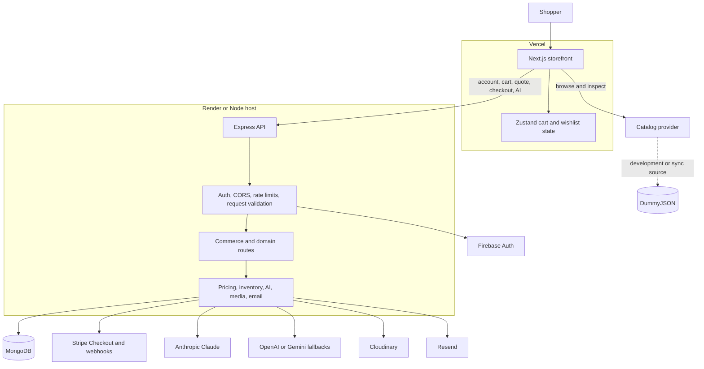

# NeoVerse Store

## See the decision before you make it

NeoVerse is a product-inspection layer for online shopping.

When a normal product photo is not enough, NeoVerse helps you compare the details, understand the object in context, inspect supported products in 3D, and reach checkout with fewer unanswered questions.

**Try the live experience:** [neoverse.sujit.top](https://neoverse.sujit.top/)

[Explore the storefront](https://neoverse.sujit.top/) · [Open the Vercel deployment](https://neoverse-store.vercel.app)

---

## The problem

Online shopping gives us more products than ever, but often not enough confidence to choose one.

Before buying a product, people still wonder:

- Will it fit the space, desk, room, or body it is meant for?
- Does the material, shape, or scale look right outside a studio image?
- Which specifications actually matter for this decision?
- Is the product available now?
- What will the final price be after shipping, tax, and discounts?
- Can I compare alternatives without opening ten more tabs?

These questions become expensive when the product is high-consideration. Uncertainty leads to hesitation, abandoned carts, avoidable returns, and a weaker relationship between customer and store.

NeoVerse is built around one outcome:

> **More confidence before checkout.**

---

## What NeoVerse does

NeoVerse brings product evidence into the buying journey.

### Browse with purpose

Search, filter, sort, and compare products without losing the facts that matter: price, availability, ratings, specifications, and category context.

### Inspect before committing

Product pages are designed for closer inspection, with imagery, structured details, and 3D or spatial tools where the product and device support them.

### Ask useful questions

The shopping assistant is catalog-grounded. It can help compare products, explain differences, and narrow the catalog without inventing products, prices, stock, reviews, capabilities, or delivery promises.

### Check out with server-side validation

Pricing and inventory are recalculated by the API. The browser is not trusted for totals, discounts, shipping, tax, or stock availability.

---

## The experience in one loop


The product is not trying to make shopping more futuristic for its own sake. It is trying to make the decision less uncertain.

---

## Who it is for

NeoVerse is for people who research before they buy—especially when appearance, proportion, compatibility, or price makes the decision consequential.

It is relevant to shoppers exploring:

- Furniture and home objects
- Electronics and accessories
- Wearables and lifestyle products
- Beauty and personal products
- Design-led technology
- Any product where a flat image leaves important questions unanswered

It is also relevant to merchants who want to turn better product information into better-qualified purchases instead of relying only on promotions and more listings.

---

## Why this is different

Most commerce experiences optimize for more browsing and faster conversion.

NeoVerse focuses on the moment before conversion: the moment when a customer decides whether the product is right.

| Typical product page | NeoVerse direction |
| --- | --- |
| Product photo as the main evidence | Product evidence staged for inspection |
| Recommendations without enough context | Catalog-grounded comparison and guidance |
| Client-provided totals sent toward checkout | Server-calculated pricing and inventory |
| Immersive features as decoration | 3D and spatial tools tied to buying questions |
| More tabs to answer basic questions | One clearer path from discovery to decision |

---

## Product tour

### 1. Start with the object

The storefront leads with the product, not a wall of marketing copy. The first question is practical: what are you considering, and what do you need to know?

### 2. Inspect the evidence

Open the product details, compare useful attributes, and use supported 3D or spatial experiences to understand form and proportion.

### 3. Get help without losing the catalog

Ask the assistant to compare or narrow options. Recommendations remain tied to the products available in the catalog.

### 4. Confirm the transaction

The API recalculates the quote and checks inventory before checkout proceeds. The intended result is a purchase with fewer surprises.

---

## Live product

**[Open NeoVerse →](https://neoverse.sujit.top/)**

The current live storefront includes:

- Product browsing and category discovery
- Search, filtering, and sorting
- Product detail and inspection surfaces
- Persistent cart and wishlist state
- Checkout quote integration
- Account and dashboard surfaces
- 3D, AR, and VR-related interfaces where supported
- Catalog-grounded shopping assistance

### A transparent note on current status

The storefront is live and actively being hardened for production commerce.

The public web catalog currently reads from the DummyJSON provider, while the Express commerce API uses MongoDB product records. Because those systems can expose different product identifiers, the catalog and transaction source of truth still need to be unified before unrestricted checkout is enabled.

The production direction is clear: MongoDB should own the product identity, price, inventory, capabilities, quote, order, and Stripe checkout record used throughout the experience.

---

## Built as a real product system



### Technology

| Layer | Technology |
| --- | --- |
| Storefront | Next.js 16, React 19, TypeScript |
| Interface | Tailwind CSS v4, Space Grotesk, Inter |
| Product state | Zustand |
| Server state | TanStack Query |
| 3D and spatial UI | Three.js, React Three Fiber, Drei, model-viewer, WebXR |
| API | Node.js, Express, Mongoose |
| Database | MongoDB |
| Authentication | Firebase Authentication and Firebase Admin |
| Payments | Stripe Checkout and webhooks |
| Shopping assistant | Anthropic SDK with OpenAI/Gemini fallbacks |
| Media and email | Cloudinary and Resend |
| Hosting | Vercel and Render |

---

## Design point of view

NeoVerse uses an **instrumented atelier** direction:

- The product object is the visual hero.
- Evidence comes before persuasion.
- Dimensions, price, stock, material, and capability states are treated as interface content.
- Deep graphite, warm paper, mineral panels, electric blue, and sparse lime create hierarchy without decorative gradients.
- Motion explains an action; it does not exist to make every section move.
- Unsupported capabilities, missing media, loading, empty, and error states are shown honestly.

The design system and interaction rules live in [`neoverse-store/DESIGN.md`](./neoverse-store/DESIGN.md).

---

## Launch assets

### Demo link

[https://neoverse.sujit.top/](https://neoverse.sujit.top/)

### Suggested demo path

1. Open the storefront.
2. Go to **Products**.
3. Search or filter for a product category.
4. Open a product detail page.
5. Inspect the image, specifications, price, rating, and stock.
6. Try the supported product-viewing experience where available.
7. Add an item to the cart and review the quote flow.
8. Open the shopping assistant and ask for a catalog-grounded comparison.

### Suggested launch video

For a short Product Hunt demo, show the problem before the technology:

1. Start with a product that is hard to judge from one image.
2. Show the relevant specifications and availability.
3. Open the inspection experience.
4. Compare it with a second product.
5. Ask the assistant to explain the trade-off.
6. Finish at the server-validated quote and checkout path.

Keep the video focused on the customer decision. Do not spend the opening seconds on framework logos, animated gradients, or infrastructure diagrams.

---

## Roadmap

The next work is focused on trust, not feature volume:

- Make MongoDB the production catalog source of truth.
- Unify product IDs across browsing, quotes, orders, inventory, and Stripe.
- Expand reliable product models and spatial assets.
- Improve inspection for categories where fit and proportion matter most.
- Add integration tests for pricing, inventory reservation, checkout, and webhooks.
- Add observability for catalog errors, AI requests, orders, and payment events.
- Measure whether product inspection improves decision confidence and reduces avoidable returns.

---

## Product principles

1. **Useful before impressive** — immersive technology must improve a buying decision.
2. **Grounded before generative** — assistance should use real catalog data.
3. **Server-authoritative commerce** — prices, stock, and totals belong to the API.
4. **Clarity before decoration** — the interface should help customers inspect and compare.
5. **Honest capability states** — unsupported features should be explicit.
6. **Confidence is the outcome** — the product exists to reduce uncertainty before checkout.

---

## Run it locally

### Requirements

- Node.js 20.9 or newer
- npm
- MongoDB for the API
- Firebase credentials for authenticated flows
- Stripe credentials for payment testing
- Provider credentials for optional integrations

### Install

```bash
cd neoverse-store
npm install

cd backend
npm install
```

### Start the API

```bash
cd neoverse-store/backend
npm run dev
```

### Start the storefront

In a second terminal:

```bash
cd neoverse-store
npm run dev
```

Open [http://localhost:3000](http://localhost:3000).

The API health endpoint is available at [http://localhost:5000/api/health](http://localhost:5000/api/health).

For full environment configuration, API routes, deployment instructions, and operational notes, read [`neoverse-store/README.md`](./neoverse-store/README.md).

---

## Repository map

```text
AR-VR-Assignment/
├── README.md                         # Product-facing launch page
└── neoverse-store/
    ├── src/                          # Next.js storefront
    ├── backend/                      # Express and MongoDB API
    ├── public/                       # Static assets
    ├── docs/                         # Product and architecture documents
    ├── DESIGN.md                     # Frontend design system
    ├── ARCHITECTURE.md                # System architecture
    ├── README.md                     # Detailed technical documentation
    └── vercel.json                    # Vercel configuration
```

## Further reading

- [`neoverse-store/README.md`](./neoverse-store/README.md) — detailed setup, API reference, environments, deployment, and operations.
- [`neoverse-store/DESIGN.md`](./neoverse-store/DESIGN.md) — visual language, interaction rules, accessibility, and visual QA.
- [`neoverse-store/ARCHITECTURE.md`](./neoverse-store/ARCHITECTURE.md) — architecture and system boundaries.
- [`neoverse-store/docs/PRD.md`](./neoverse-store/docs/PRD.md) — product requirements and intended customer value.
- [`neoverse-store/docs/ARCHITECTURE_REVIEW.md`](./neoverse-store/docs/ARCHITECTURE_REVIEW.md) — known architecture risks and recommendations.

## Status

NeoVerse Store is an active product build.

The storefront is live. The next major milestone is aligning the public catalog and transaction system so every product shown to a customer is backed by the same authoritative identity, price, inventory, and checkout record.

## License

No license file is currently included. Add an explicit license before distributing the project outside its owning organization.
