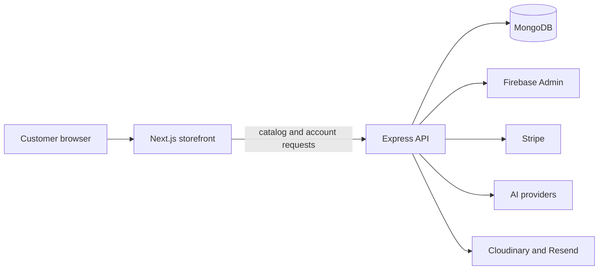

# Product architecture

The browser loads the Next.js storefront from Vercel. The storefront owns page rendering and interaction state, while the Express API owns server-side commerce decisions and protected integrations.

## Ownership boundaries

| Boundary | Owner | Rule |
| --- | --- | --- |
| Page rendering and public browsing | Next.js | Keep interaction fast and progressively enhanced |
| Cart and wishlist UI state | Zustand | Treat it as local presentation state until synchronized |
| Prices, discounts, tax, shipping, and stock | Express API | The browser cannot be authoritative |
| Orders and payment sessions | Express API and Stripe | Verify webhook signatures and use idempotency |
| User identity | Firebase Auth and Firebase Admin | Verify tokens at the API boundary |
| Product records | MongoDB target source of truth | Do not let development providers become checkout truth |

## Current catalog boundary

The public catalog can still use DummyJSON through the Next.js provider layer, while the commerce API reads MongoDB records. Those systems can expose different identifiers, so production checkout is not considered fully reliable until browsing and order flows share one catalog identity.

The intended direction is MongoDB as the production source of truth, with any external seed provider treated as an explicit development or synchronization input.

## Design consequence

The frontend should make uncertainty visible rather than papering over it. If a capability, stock value, image, or quote is unavailable, the UI should say so and offer the next useful action.
