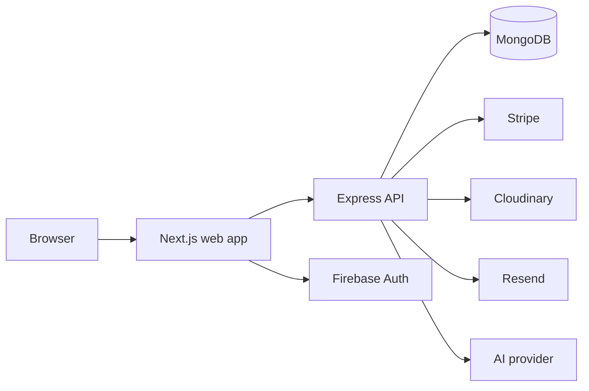

# NeoVerse Store Architecture Review

**Scope:** frontend, backend API, authentication, catalog, immersive experiences, cart, wishlist, checkout, recommendations, and deployment documentation.

**Verdict:** ship-with-guards for portfolio/demo use; rework before production commerce traffic.

## 1. System context

NeoVerse is a modular monolith split into two deployable applications:

- Next.js App Router frontend on Vercel.
- Express/Mongoose API on a long-running service with MongoDB Atlas.
- Firebase Authentication is the identity provider.
- Stripe, Cloudinary, Resend, and AI providers are external adapters.

The split is appropriate for the current product and team size. A microservice decomposition is not justified yet: the backend still has shared user, product, order, and integration concerns, and independent failure boundaries plus operational ownership are not yet established.



## 2. Bounded contexts

| Context | Source of truth | Current modules | Boundary status |
|---|---|---|---|
| Identity | Firebase user/token plus Mongo user projection | `components/auth`, `middleware/auth.js`, `models/User.js` | Partial; browser session and server authorization are separate concerns but not fully aligned |
| Catalog | Mongo `Product` and `Category` documents, with external provider fallback for public Next routes | `lib/services/product-service.ts`, product controllers/models | Drift; two catalog access paths exist |
| Discovery | Query parameters, search history, recommendation events | product routes, recommendation controllers, search UI | Partial |
| Shopping | Cart document for authenticated users; local Zustand state for guests | `store/cart-store.ts`, cart API | Partial; sync policy is not centralized |
| Wishlist | User wishlist array | wishlist controller/store | Partial; local toggle can diverge from API |
| Order | Mongo `Order`, inventory on `Product` | order controller/model, checkout UI | Improved; server now owns pricing and inventory reservation |
| Immersive media | Product `modelUrl` and image URLs | AR/VR components, product viewer | Partial; missing/invalid assets must be a first-class state |
| Operations | Logs, health endpoint, deployment configuration | `server.js`, Render/Vercel docs | Partial; no explicit SLO, tracing, or recovery runbook |

## 3. Dependency direction

Expected direction:

```text
Route/page -> feature UI/use case -> service/port -> adapter/API/DB
                          \-> shared domain types and policies
```

Current code generally follows this for product API routes, but several pages call `api` directly and the backend controllers combine validation, pricing policy, persistence, and integration behavior. Keep the modular monolith and move policy into services before considering more deployment units.

## 4. Non-negotiable invariants

1. Prices, discounts, tax, shipping, and stock are authoritative on the server.
2. A user can only read or mutate their own cart, wishlist, profile, and orders unless authorized as admin.
3. Firebase identity is verified at every protected API boundary.
4. Product media failures degrade to an explicit unavailable state; no fake product is presented as purchasable inventory.
5. Order creation is idempotent and inventory cannot be decremented twice for one payment attempt.
6. Guest state may be merged into an authenticated account, but the account state remains the source of truth after login.
7. External providers are adapters; domain types must not be named after provider SDKs.

## 5. Findings

- `backend/controllers/orderController.js`: **critical [XAPI-1, XD-1, XR-1]**. Client prices were previously trusted and inventory updates were separate from order creation. The current pass makes totals server-derived and uses a Mongo transaction; payment idempotency and replica-set availability still need verification.
- `src/components/auth/AuthContext.tsx`, `src/proxy.ts`: **high [XSEC-1, XAPI-2]**. The browser writes an ID token into a readable `__session` cookie while the middleware only checks cookie presence. This is not sufficient server authorization and exposes a bearer token to JavaScript. Replace presence-based middleware gating with a server-verifiable session cookie or allow the page guard to own the redirect while the API remains authoritative.
- `src/store/cart-store.ts`, `backend/controllers/cartController.js`: **high [XDOM-1, XD-2]**. Guest and account carts have separate stores without one synchronization use case. Add a typed cart service that owns load, merge, and mutation reconciliation.
- `src/store/wishlist-store.ts`: **high [XDOM-2]**. Local optimistic state can diverge from the user wishlist projection. Add API-backed mutation hooks with rollback and invalidate the wishlist query after success.
- `src/app/checkout/page.tsx`: **high [XAPI-3]**. The UI still displays local totals. Use a server quote endpoint before payment and render the returned quote; never use the browser total as an order authority.
- `src/components/ar-vr/ARViewer.tsx`: **medium [XREL-1]**. AR capability detection and model-viewer readiness are browser-dependent. The component now avoids launch before registration, but needs explicit load/error events and a tested fallback for unsupported devices.
- `src/components/product/ProductViewer.tsx`: **medium [XREL-2]**. The fallback visual is useful for presentation but must not imply a real product model exists. Surface model availability and load failure to the user.
- `backend/routes/authRoutes.js` and `backend/routes/userRoutes.js`: **medium [XAPI-4]**. Duplicate profile route families create contract ambiguity. Canonicalize `/api/users/profile`; retain a temporary compatibility route only with deprecation logging.
- `backend/server.js`: **high [XSEC-2, XR-2]**. CORS currently allows all origins despite an allowlist. Production must reject unknown origins and configuration must fail closed when `FRONTEND_URL` is missing.
- `docs/PRD.md` versus `docs/DEPLOYMENT.md`: **medium [XDOC-1]**. Versions, endpoints, and auth descriptions drift. Treat the running code and OpenAPI-style contract as the source of truth, then update docs in the same change.

## 6. Production architecture recommendation

Keep the current two-deployable modular monolith. Organize by business capability inside each deployable:

```text
frontend/src/
  app/                 # route composition and metadata
  components/ui/       # domain-neutral primitives
  modules/
    identity/          # auth UI, session hooks, identity contracts
    catalog/           # product/category UI, queries, catalog contracts
    discovery/         # search, recommendations, event tracking
    immersive/         # viewer, AR, VR, media capability policy
    shopping/          # cart, wishlist, checkout UI and hooks
    account/           # profile, addresses, notifications, orders
    administration/    # admin UI and admin queries
  infrastructure/      # API client, Firebase, query provider, config
  shared/              # types, validation, formatting, route policy

backend/
  routes/              # HTTP adapters only
  controllers/         # request/response translation only
  modules/
    identity/
    catalog/
    shopping/
    ordering/
    discovery/
    communication/
  infrastructure/     # Mongo, Firebase, Stripe, Cloudinary, Resend
  middleware/
```

Do not perform a mass move now. Introduce the module boundaries when touching each context, preserving import compatibility and adding tests around the use case first.

## 7. Ordered delivery plan

### Foundation and trust boundaries

- Define canonical API contracts for identity, catalog, cart, wishlist, quote, and order.
- Add environment validation at process startup; never silently fall back to production-risk defaults.
- Make CORS fail closed in production.
- Add request correlation IDs, structured error responses, health/readiness checks, and redacted logging.
- Add API and UI tests for unauthorized access and malformed payloads.

### Identity

- Replace readable bearer-token cookie gating with a server-verifiable session mechanism.
- Keep Firebase UID as the stable external identity; use `firebaseUid` consistently in Mongo.
- Consolidate profile routes and add role checks at the API boundary.

### Catalog and immersive media

- Choose one catalog source of truth for production. If external providers remain fallback adapters, make that behavior explicit and observable.
- Validate `modelUrl` and asset type at ingestion.
- Add model load/error/unsupported states and real device testing for WebXR, Scene Viewer, and Quick Look.

### Shopping and ordering

- Introduce cart query/mutation hooks and reconcile guest state through one merge use case.
- Introduce wishlist query/mutation hooks with optimistic rollback.
- Add `POST /api/orders/quote` or equivalent server quote contract.
- Add idempotency keys to order/payment creation and verify Stripe webhook signatures before state transitions.
- Use Mongo transactions only when the deployment topology supports them; otherwise use a reservation/state machine design.

### Operations

- Define initial targets: catalog p95 < 500 ms, quote p95 < 500 ms, order creation p95 < 1 s, API availability >= 99.9% monthly.
- Track checkout conversion, payment failures, inventory conflicts, AR launch success, model load failures, and recommendation click-through.
- Add staged deployment, rollback instructions, backups, and incident ownership.

## 8. Architecture baseline matrix

BASELINE | frontend app routes | expected: route composition only, dependencies inward to feature policies | observed: several pages contain query/mutation and domain orchestration directly | fit: partial | patterns: [P-BOUNDARY] | violations: [X-UI-1] | suggestion: extract one query/mutation hook per account and shopping workflow as each route changes

BASELINE | frontend infrastructure | expected: API/auth/query configuration at composition boundary | observed: `lib/api.ts`, Firebase auth, providers, config are centralized | fit: align | patterns: [P-COMPOSITION] | violations: [] | suggestion: add startup/runtime validation and keep provider-specific details behind adapters

BASELINE | frontend stores | expected: client cache and interaction state, no server authority | observed: cart and wishlist persist local state and can diverge from API | fit: partial | patterns: [P-STATE] | violations: [XDOM-1, XDOM-2] | suggestion: make server queries authoritative after authentication and use stores only for guest/ephemeral state

BASELINE | backend routes/controllers | expected: transport adapters translate validated requests to use cases | observed: controllers own validation, pricing, persistence, and inventory mutation | fit: partial | patterns: [P-ADAPTER] | violations: [XAPI-1] | suggestion: extract order pricing/inventory policy into an ordering service

BASELINE | backend persistence | expected: aggregate ownership, atomic transitions, indexed queries | observed: Mongo models exist and order creation now uses a transaction | fit: partial | patterns: [P-AGGREGATE] | violations: [XD-1] | suggestion: add idempotency and verify replica-set transaction support

BASELINE | immersive experience | expected: capability-aware adapter with explicit asset and failure states | observed: WebXR/model-viewer/R3F paths exist; assets and fallback semantics are incomplete | fit: partial | patterns: [P-PORTS] | violations: [XREL-1, XREL-2] | suggestion: add an immersive capability/media policy and failure telemetry

BASELINE | deployment/operations | expected: repeatable deploy, health/readiness, secrets, rollback, observable dependencies | observed: Vercel/Render docs and health endpoint exist; CORS, readiness, SLOs, and rollback evidence are incomplete | fit: partial | patterns: [MS-OPERABILITY] | violations: [X-MS-OPERABILITY] | suggestion: establish production gates before accepting real payment traffic

CODEBASELINE | `backend/controllers/orderController.js` | responsibility: create an order from validated user intent | observed: server-derived pricing, stock checks, transactional reservation and persistence | fit: clean | practices: [CC-SINGLE-RESPONSIBILITY] | violations: [XC-IDEMPOTENCY] | next: add an idempotency key and integration test for duplicate submissions

CODEBASELINE | `src/components/ar-vr/ARViewer.tsx` | responsibility: launch an AR-capable product media experience | observed: capability detection, dynamic model-viewer readiness, platform fallback | fit: clean | practices: [CC-EXPLICIT-STATE] | violations: [XC-MEDIA-ERROR-STATE] | next: render model load/error and unsupported-device states explicitly

CODEBASELINE | `src/store/cart-store.ts` | responsibility: manage guest cart interaction state | observed: persisted local items, quantity clamping, subtotal calculation | fit: partial | practices: [CC-VALIDATED-STATE] | violations: [XC-SERVER-SYNC] | next: move authenticated synchronization into a dedicated cart mutation hook

## 9. Validation

VALIDATION | agents: [ARCH-PRIMARY, ARCH-ADVERSARY, ARCH-SYNTH] | agreement: medium | unresolved: 3 | ready: no

Unresolved items:

1. Firebase session-cookie strategy must be validated against the deployed Next.js runtime and Firebase Admin configuration.
2. MongoDB deployment must be verified as a replica set before relying on transactions.
3. Payment/idempotency and webhook behavior require integration tests with Stripe test mode.
