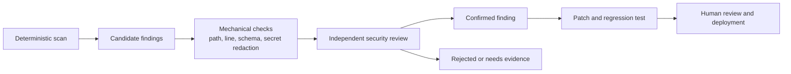

# NeoVerse security harness

## Why this exists

The Cloudflare vulnerability-harness research highlights a useful architectural rule: the model is not the durable security system. The durable system is the orchestration around it—explicit state, narrow tasks, independent validation, reproducible evidence, and the ability to change models without changing the workflow.

NeoVerse is not a 128-repository security fleet, so this project should not copy that operational scale prematurely. The appropriate first step is a small, deterministic baseline that catches obvious repository and configuration risks and emits candidates for independent review.

## Current implementation

Run from `neoverse-store/`:

```bash
node backend/security-harness.js
```

The scanner writes:

```text
security-findings.json
```

The report is intentionally machine-readable and includes:

- schema version;
- generation timestamp;
- deterministic rule identifier;
- severity;
- repository-relative file and line;
- evidence excerpt;
- candidate status;
- explicit validation requirement.

The scanner is a **candidate generator**, not a vulnerability verdict. A regular-expression match is not proof that a secret is active, reachable, exploitable, or deployed. Findings must be independently validated before remediation or escalation.

## Baseline rules

| Rule | Detects | Default severity |
| --- | --- | --- |
| `SEC-001` | Firebase service-account filenames in non-example files | Critical |
| `SEC-002` | Private-key markers in repository text | Critical |
| `SEC-003` | Common provider credential patterns in non-example files | High |
| `SEC-004` | CORS callback that allows unknown origins | High |
| `SEC-005` | Possible logging of sensitive provider environment variables | High |

The rules are intentionally narrow. Add a rule only when it has a clear validation procedure and a useful remediation path.

## Recommended workflow



### 1. Scan

Run the deterministic scanner against the repository. It should be cheap enough to run locally and in CI.

### 2. Mechanical validation

Before an agent or human spends time on a candidate, verify:

- the referenced file exists;
- the line is still present;
- the finding matches the current checkout;
- secrets are redacted from reports and logs;
- the JSON report conforms to its schema;
- generated output is not accidentally committed if it contains sensitive evidence.

### 3. Independent review

Use a separate reviewer or model context to challenge the candidate. The reviewer must answer:

- What is the attacker model?
- What trust boundary is crossed?
- Is the value a real credential, a placeholder, or a filename only?
- Is the path reachable in production?
- Can the issue be reproduced without modifying the source under test?
- What is the smallest safe remediation?

The reviewer must not validate its own discovery as the only evidence.

### 4. Patch and regression test

Every confirmed issue should include:

- a clear impact statement;
- a reproducible test or configuration check where practical;
- a minimal patch;
- a regression test or CI rule preventing recurrence;
- human review before deployment.

The fixer must never merge or deploy its own patch automatically.

## State and persistence direction

The current scanner writes one report file because the project has no security findings database or CI findings store. If repeated scans become operationally necessary, the next step should be a small persisted findings store keyed by:

```text
(run_id, repository, rule, file, line, fingerprint)
```

Required state transitions:

```text
candidate -> mechanically_validated -> independently_reviewed
          -> confirmed | rejected | needs_evidence
confirmed -> patched -> human_approved -> deployed
```

Do not add a workflow engine, agent fleet, or cross-repository graph until repeated scans demonstrate that a missing capability is the actual bottleneck.

## Model-agnostic review boundary

If an LLM is later added to the review stage:

- keep the scanner and report schema independent of the provider;
- pass only the minimum source context required for the finding;
- keep deterministic checks outside the model;
- require structured output validated by code;
- record model, prompt version, and review outcome;
- allow a different provider or model to review discovery output;
- never treat model confidence as proof of exploitability.

The current application already has Claude, OpenAI, and Gemini integrations for shopping assistance. Those product providers must not be silently reused as a security decision engine without a separate security prompt, schema, audit trail, and approval boundary.

## Production security priorities for NeoVerse

The Cloudflare pattern maps to these concrete priorities:

1. Remove and rotate the Firebase service-account credential file currently present in the backend workspace.
2. Make production CORS fail closed for unknown origins.
3. Add integration tests for authentication, order pricing, inventory reservation, Stripe webhooks, and duplicate requests.
4. Keep secrets out of generated findings, logs, browser bundles, and public environment variables.
5. Add CI execution for the deterministic scanner and fail on confirmed secret exposures.
6. Add a persisted findings store only after repeated scan history is needed.
7. Add independent AI review only after deterministic checks and reproducible test evidence are in place.

## Non-goals

This harness does not currently claim to:

- prove absence of vulnerabilities;
- replace dependency scanning, secret scanning, SAST, DAST, or penetration testing;
- analyze production reachability across repositories;
- execute arbitrary exploit payloads;
- autonomously patch or deploy code;
- provide a security compliance certification.
